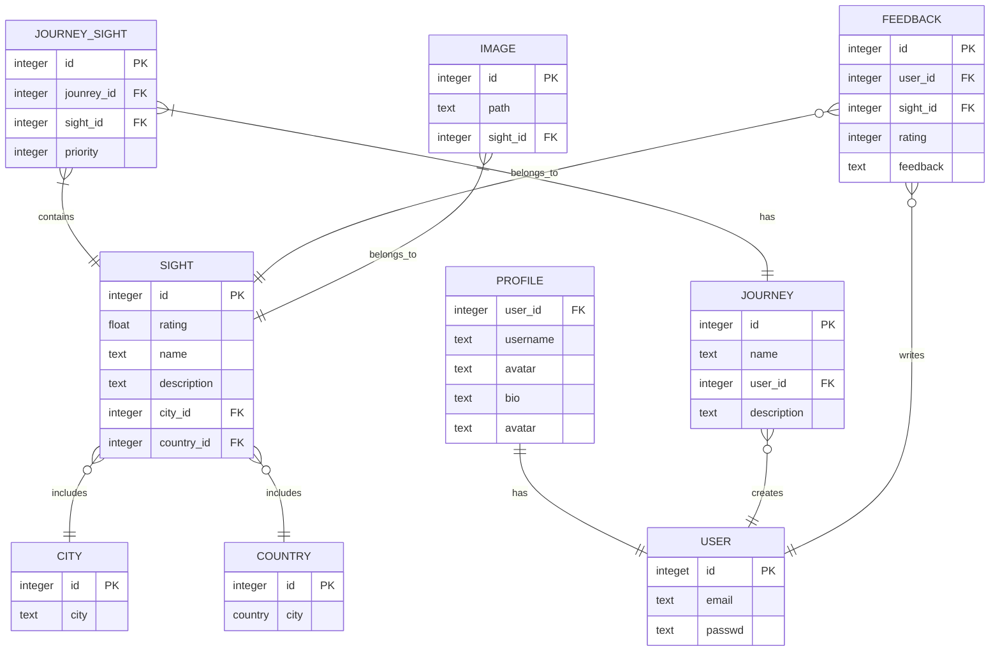

```mermaid    
    erDiagram
        USER {
            integet id PK
            text email
            text passwd 
        }
        PROFILE {
            integer user_id FK
            text username
            text avatar
            text bio
            text avatar
        }
        CITY {
            integer id PK
            text city 
        }
        COUNTRY {
            integer id PK
            country city 
        }
        SIGHT {
            integer id PK
            float rating
            text name
            text description
            integer city_id FK
            integer country_id FK
        }
        IMAGE {
            integer id PK
            text path
            integer sight_id FK
        }
        JOURNEY {
            integer id PK
            text name
            integer user_id FK
            text description
        }
        JOURNEY_SIGHT {
            integer id PK
            integer jounrey_id FK
            integer sight_id FK
            integer priority
        }
        FEEDBACK {
            integer id PK
            integer user_id FK
            integer sight_id FK
            integer rating
            text feedback
        }

        PROFILE ||--|| USER : has
        SIGHT }o--|| CITY: includes
        SIGHT }o--|| COUNTRY: includes
        JOURNEY }o--|| USER : creates
        JOURNEY_SIGHT }|--|| JOURNEY: has
        JOURNEY_SIGHT }|--|| SIGHT : contains
        FEEDBACK }o--|| USER : writes
        FEEDBACK }o--|| SIGHT : belongs_to
        IMAGE }|--|| SIGHT : belongs_to

```
